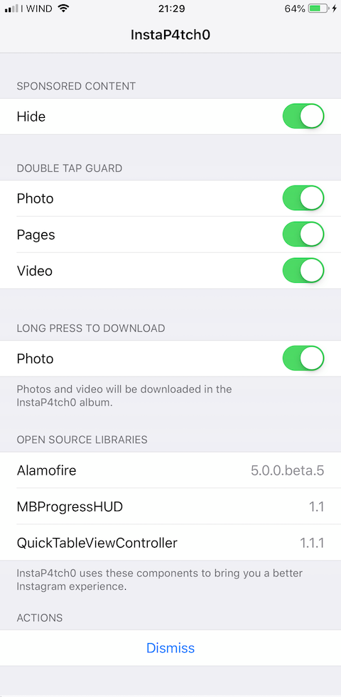
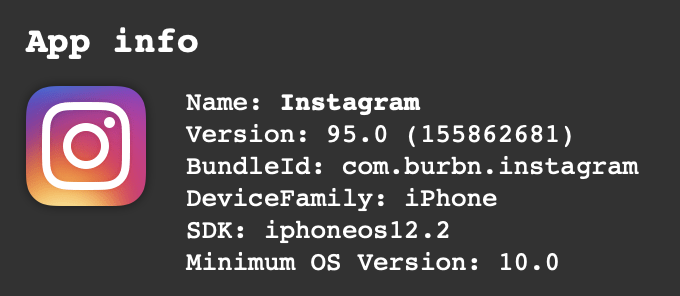

# InstaP4tch0

Modded Instagram for non-jailbroken iDevices.

Min iOS version: `10.0`.

Compiled using iOS `12.2` SDK.

Supported architectures: `armv7 arm64`.

Made possibile by `theos-jailed` and `CydiaSubstrate`.

# Implemented Features

- In app settings to enable/disable features (long press on InstaP4tch0 logo).
- Localised in: 🇬🇧, 🇮🇹.
- Hide sponsored content (main feed / stories).
- Double tap guard when liking a photo, pages or a video.
- Long press on a photo/video to download it.

# Coming Soon

- Long press on pages to download all the media.

# Not working (and probably will never work)

- Push notifications
- CloudKit related functionality
- PassKit related functionality

# Development Tools

- Theos (https://github.com/theos/theos)
- Theos Jailed Module (https://github.com/kabiroberai/theos-jailed)
    - ~~Needs a patch for linking against Swift frameworks: https://github.com/kabiroberai/theos-jailed/issues/58#issuecomment-497927651~~ Patch is now integrated in the Makefile
- iOS 12.2 Theos-ready SDK (https://github.com/DavidSkrundz/sdks)
- Instagram universal IPA (iMazing to make sure it's universal -> jailbroken device -> decrypt)

# Swift runtime

Added Swift 5 thinned runtime (`armv7` / `arm64`) in `Resources/Frameworks` to make the IPA work on devices running older versions of iOS (from 10.x.x to 12.1.x)

# Sideloading

Tested utilities:
- `Cydia Impactor`
- `ios-deploy`

# Instagram IPA version

